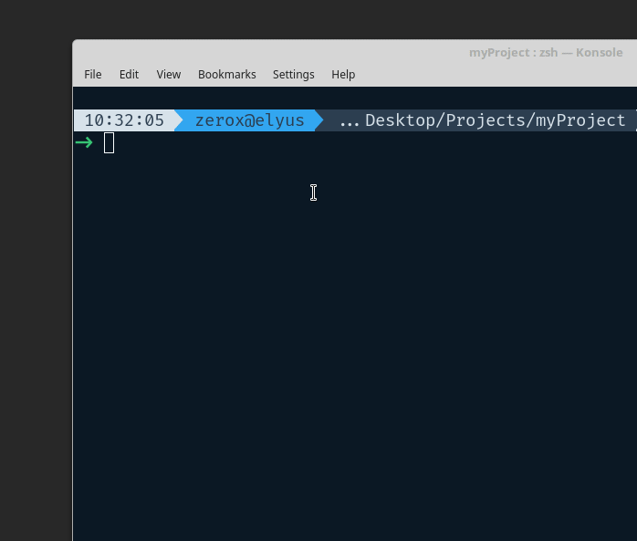

<h1 align="center">CommitTasks</h1>

<h4 align="center">
  Plan & commit your changes with ease :tada:
</h4>

<div align="center">
  
</div>

## About this project

CommitTasks is a small, robust cli for developers to plan and manage their git commits in multiple projects. In other words, CommitTasks is a combination of `git commit` & todo list.
With just a few examples, the users can learn to plan, prepare and commit their changes with confident.

## Features

- Manage commit tasks in separate projects
- Search for tasks
- Simple & easy to use
- Commit and receive commit details
- Highlight tasks

## Install

```
npm install -g committasks
```

## Usage

```
$ ct --help

  Usage:
    $ ct [<options> ...]

    Options:
        none            Display all tasks
      --task, -t        Create task
      --remove, -rm     Remove a task or a project
      --commit, -c      Commit a task
      --list, -l        Display all tasks in a project
      --find, -f        Search for a task
      --edit, -e        Edit a task commit's message
      --create, -cp     Create a project for a task (requires --task)

    Examples:
      $ ct
      $ ct --task MyProject Fix issue #45
      $ ct --remove MyProject 1
      $ ct --remove . 1
      $ ct --commit MyProject 2
      $ ct --commit . 2
      $ ct --list MyProject
      $ ct --list .
      $ ct --find My task
      $ ct --edit MyProject 2 New message
      $ ct --edit . 2 New message
      $ ct --task NotExistProject Fix issue #45 --create
      $ ct --create --task NewProject Fix issue #45
```

## How to use

In all the examples bellow, if your current working directory has the same name as your project name in CommitTasks list then you can replace your project name with a `.` character.

### Create task

You can use `--task`/`-t` flag to create a new task.

```
$ ct --task MyProject Updated README with the new details
```

If the project that you are about to create does not exist then you must specify the flag `--create`/`--cp` for CommitTasks to understand that you want to create a new project.

```
$ ct --task ProjectToBeCreateded Improve documentation --create
```

### Commit a task

After you apply all your changes, you can use the flag `--commit`/`--c` followed by your project name and task id to commit your changes. Your task content will be used as the commit message.

```
$ ct --commit MyProject 1
```

If no files are specified, `git add .` will be assumed. However, if you want to specify a set files to be commited, you can combine the `--commit`/`--c` flag with `--files`/`--cf` flag to specify the files that you want to commit.

```
$ ct --commit MyProject 1 --files index.js css/index.css index.html
```

### List all task in a project

If you're working on a specific project and only wish to see tasks in that project, then you can use the `--list`/`--l` flag with a project name to show only tasks in your desired project.

```
$ ct --list MyProject
```

### Edit a task commit message

As mentioned earlier, the task content will be used as the commit message by default. If you wish to change it, use the `--edit`/`--e` flag followed by the project name, task id and the new message.

```
$ ct --edit MyProject 1 Updated commit message
```

### Highlight a task

To highlight a task, you can use the flag `--highlight`/`--hl` followed by the project name, task id and the status of the highlight that you want.
Supported status:

- `urgent`
- `important`
- `none`

```
$ ct --highlight MyProject 1 urgent
```

### Remove a task or project

To remove a task, you can simply use the flag `--remove`/`--rm` followed by the project name and the task id.

```
$ ct --remove MyProject 1
```

You can do the same thing to delete the whole project, but this time, only project name is required.

```
$ ct --remove MyProject
```

## Author

- Hung Nguyen <viethungax@gmail.com> ([twitter](https://twitter.com/ZeroX_Hung))

## Donatations

<a href="https://www.buymeacoffee.com/hQteV8A" target="_blank"></a>

## License

[MIT](LICENSE.md)
